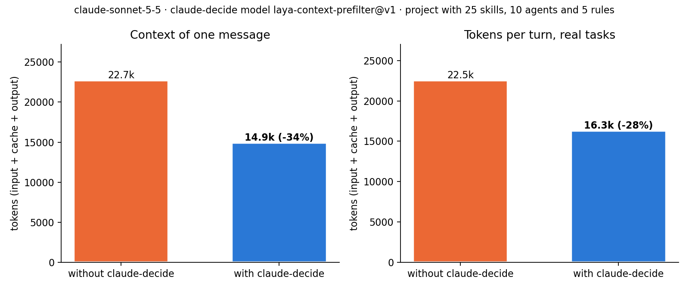
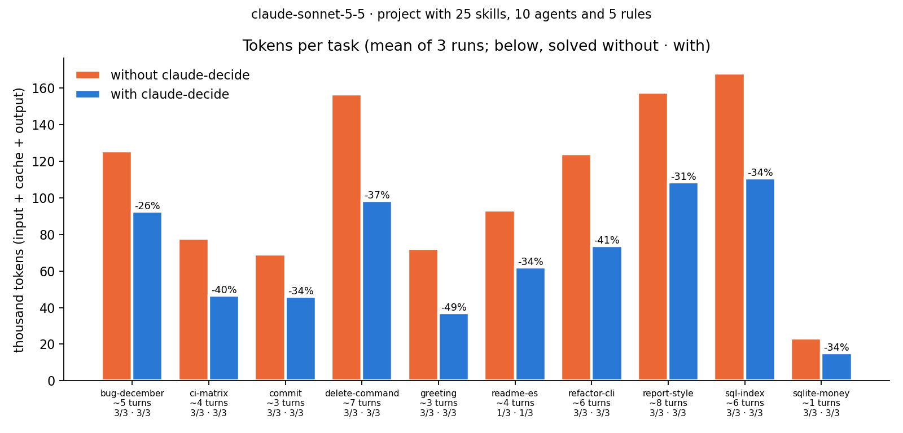

<div align="center">

# claude-decide

**Stop paying Claude to read every skill you ever installed.**

A Claude Code plugin with a small local decision model that picks, for every request and every tool step, which
skills, rules, agents and MCP tools Claude actually needs, and hands it only those.

[](https://github.com/zamax14/claude-decide/actions/workflows/tests.yml)
[](LICENSE)
[](https://code.claude.com/docs/en/plugins)
[](https://huggingface.co/Zamax14/laya-context-prefilter)
[](#install)

</div>

<p align="center"></p>

## Why

Every skill, agent and rule you install is read by Claude on **every message**, whether the request needs it or
not. A couple of skill collections plus some rules add thousands of tokens of descriptions to each turn, the context
fills up sooner, and each turn costs more.

claude-decide trims that. Your skills go to "name only" and your rules move to a library. A 322M-parameter model
(Laya, fine-tuned for this job) reads each request and scores every installed item in one pass, in about a quarter of
a second for 50 items on a GPU. Claude gets back the full description of the few items that fit.

## Results

### Tokens on real tasks

The benchmark project is a small expense-tracker CLI with tests, a Dockerfile and CI. Its `.claude/` holds what
someone with a couple of collections installed would have: **25 skills, 10 agents and 5 rules**. They are public
(MIT and CC0), and half of them relate to the project's stack.

The tasks: 10 real ones (a bug, a new command, report styling, a commit, a translation, CI, an SQL index, a refactor,
a question and a greeting), plus one single-turn message. Each runs 3 times without and with claude-decide, on
Claude Sonnet 5.5 and on Claude Haiku 4.5, with at most 15 turns and nothing from the user's own configuration.

| Model | claude-decide | Tokens per task | Tokens per turn | Context of one message | Cost per task | Tasks solved |
|---|---|---|---|---|---|---|
| Sonnet 5.5 | without | 106,750 | 22,514 | 22,685 | $0.101 | 28/30 |
| | **with** | **69,080 (−35%)** | **16,317 (−28%)** | **14,911 (−34%)** | **$0.062 (−39%)** | **28/30** |
| Haiku 4.5 | without | 206,428 | 24,771 | 24,751 | $0.061 | 22/30 |
| | **with** | **177,027 (−14%)** | **20,583 (−17%)** | **20,377 (−18%)** | **$0.050 (−18%)** | **24/30** |

<p align="center"></p>

- **Every task costs less on Sonnet**: 26–49% fewer tokens, and some take fewer turns (a new command, 8.3 to 5.3; a
  refactor, 6.7 to 4.7). About 7,800 fewer tokens per message.
- **Haiku saves less but still saves**: about 4,400 fewer tokens per message, and 9 of the 10 tasks use 9–24% fewer
  tokens ([chart](bench/tokens/charts/tasks.png)). The greeting's +6% is one extra turn.
- **No loss in quality**: the same 28 of 30 tasks solved with and without the plugin on Sonnet, 24 against 22 on
  Haiku. On Sonnet the failures are the translation, which Sonnet sometimes writes to a new `README.es.md` while the
  check reads `README.md`, under both conditions; on Haiku they are tasks that don't fit in 15 turns.
- **The saving grows with the catalog.** With 100 skills, 50 agents and 15 rules, one message drops from 63k to
  33k tokens (−48%).

Reproduce it with [`bench/tokens/`](bench/tokens).

### Picking the right items

The ranking benchmark has 39 requests with hand-labelled answers, run against a real catalog of 49 skills, rules,
agents and MCP tools. Three of the requests should trigger nothing ("hi", general questions).

| Model | hit@1 | hit@3 | recall@5 | MRR | Top score on "needs nothing" |
|---|---|---|---|---|---|
| Laya multilingual (base, with prior) | 0.33 | 0.50 | 0.50 | 0.46 | 0.91 |
| Laya fine-tuned for helpdesk tickets (with prior) | 0.36 | 0.53 | 0.57 | 0.51 | 0.58 |
| **[laya-context-prefilter](https://huggingface.co/Zamax14/laya-context-prefilter) (no prior)** | **0.86** | **1.00** | **0.94** | **0.93** | **0.06** |

- **A threshold that works**: at 0.5, a request that needs nothing gets nothing. The others get 2.4 items on
  average, with recall 0.82 and precision 0.45. The earlier models never got past 0.15 precision.
- **It generalizes to catalogs it never saw**: on 3,120 pairs from held-out repositories and MCP servers it is right
  90% of the time, against 41% for the base model, with a Brier score of 0.078.

## How it works

```
your request / each tool step ──► hook.py (UserPromptSubmit, PostToolUse)
                                     └─► daemon.py (model loaded once, 127.0.0.1:7717)
                                           ├─ catalog.py   skills, rules, agents and MCP tools in this session
                                           ├─ scorer.py    one yes/no question per item, one forward pass
                                           └─ context      what Claude doesn't have yet ──► additionalContext
library.py ── trims ~/.claude/settings.json and ~/.claude/rules, and undoes it
```

- **Catalog**: everything Claude Code loads:
  - `~/.claude/{skills,rules,agents}`
  - enabled plugins
  - the project's `.claude/`
  - the tools of configured MCP servers, listed with `tools/list` and cached for a day
- **Scoring**: the state is `{"request", "step"}`. For each item the model answers *"Is this Claude Code skill useful
  for handling the user's request?"* and returns a calibrated probability.
- **What Claude gets back for a picked item**:

  | Picked item | What Claude receives |
  |---|---|
  | skill trimmed to name only | its full description |
  | rule moved to the library | its full text |
  | MCP tool | its description and the `ToolSearch select:…` call to load it |
  | anything else | its name and score |

- **Every step**: on each tool call it scores again with the request plus the current step
  (`Bash npm test`, `Edit src/api.ts`) and sends at most 2 items it hasn't sent for that request.
- **Never in the way**: if the daemon is down, the hook starts it in the background and injects nothing that time.
  A timeout or error means nothing is injected.
- **Private**: the model runs on your machine, the daemon listens only on `127.0.0.1`, and your prompts never leave
  your computer.

### What can be trimmed

| | How | Saves context |
|---|---|---|
| Your own skills (`~/.claude/skills`) | `skillOverrides: "name-only"`: Claude still sees the name and can invoke the skill | Yes |
| Rules | moved to `~/.claude/library/rules`, injected when picked (`library.py manage rule:x`) | Yes, opt-in per rule |
| Plugin skills | Claude Code doesn't apply `skillOverrides` to them | No, ranking only |
| Agents | Claude Code has no way to hide them | No, ranking only |
| MCP tools | Claude Code already defers them; the plugin says which one to load | One search, not context |

## Install

You need Python 3.10+ and, for the hook to answer in time, preferably an NVIDIA GPU.

```bash
git clone https://github.com/zamax14/claude-decide.git && cd claude-decide

# The model's environment, outside the plugin folder (Claude Code replaces that folder on updates)
python3 -m venv ~/.claude-decide/venv
~/.claude-decide/venv/bin/pip install -r requirements.txt
# NVIDIA GPU: ~/.claude-decide/venv/bin/pip install torch==2.14.0 --index-url https://download.pytorch.org/whl/cu130

claude plugin marketplace add "$PWD"
claude plugin install claude-decide@claude-decide --scope user
```

Point the plugin at that Python in `~/.claude/settings.json`:

```json
{ "env": { "CLAUDE_DECIDE_PYTHON": "/home/you/.claude-decide/venv/bin/python" } }
```

Then trim your own skills. `restore` undoes everything:

```bash
python3 library.py apply           # your skills go to name only
python3 library.py manage rule:x   # optional: move a rule to the library (unmanage to bring it back)
python3 library.py status
```

On first use the daemon downloads [laya-context-prefilter](https://huggingface.co/Zamax14/laya-context-prefilter),
about 650 MB.

`library.py` never touches a skill you already overrode yourself. It keeps a copy of your `settings.json` from before
its first change, and it refuses to trim anything while the plugin is disabled: without the hook, Claude would lose
the descriptions in every session.

## Configuration

These are environment variables, set in the `env` of `~/.claude/settings.json`:

| Variable | What for | Default |
|---|---|---|
| `CLAUDE_DECIDE_PYTHON` | Python with `laya` and `torch` that runs the daemon | the plugin's `.venv/bin/python` |
| `CLAUDE_DECIDE_MODEL` | `prefilter`, `laya` (base), a local checkpoint folder or a Hugging Face repo `user/model[@rev]` | `prefilter` |
| `CLAUDE_DECIDE_MODE` | `auto`: inject when something was trimmed; `inject`: always; `log`: never, only log | `auto` |
| `CLAUDE_DECIDE_DEVICE` | `cuda` or `cpu` | whatever torch sees |
| `CLAUDE_DECIDE_PORT` | the daemon's local port | `7717` |
| `CLAUDE_DECIDE_HOME` | state, cache, prior and logs | `~/.claude-decide` |
| `CLAUDE_DECIDE_HF_HOME` | a Hugging Face cache that already has the model | the default one |

Every decision is logged to `~/.claude-decide/logs/decisions.jsonl`, with the request or step and the ranking.

## The model

[laya-context-prefilter](https://huggingface.co/Zamax14/laya-context-prefilter) is
[Laya multilingual](https://github.com/NandhaKishorM/laya), an open 322M-parameter System One model (mmBERT), fine-tuned
with [Laya-Finetune](https://github.com/zamax14/Laya-Finetune).

- **Catalog**: 2,276 skills, agents, rules and MCP tools from public repositories and MCP servers, plus synthetic
  ones.
- **Requests**: 9,000, in English, Spanish and Portuguese, written by an LLM for items drawn from that catalog, with
  and without a tool step.
- **Negatives**: each request is paired with the most similar items (hard negatives) and with random ones.
- **Judges**: two LLM judges of different families checked every labelled pair and relabelled the ones they agreed
  were wrong.
- **Training set**: 46,763 pairs, trained at 1k tokens of context.
- **Held out**: about 15% of the sources were never trained on, and that is where the 90% comes from.

Any other model works if it has `name` and `predict(state, questions)` and returns Laya-shaped answers
(`{"answers": {id: {"noul": p}}}`). Add it to `MODELS` in `model.py` and compare it with `python bench/run.py`. To
retrain on your own catalog, use the `context_prefilter` task of Laya-Finetune. A checkpoint with
`model_name: laya-context_prefilter` gets the same state and runs without a prior.

## Limitations

- **CPU is slow**: ~4.6 s for 49 items, and the hook gives up after 3 s. Without a GPU the plugin only helps with small
  catalogs.
- **Built-in skills and agents** of Claude Code aren't on disk and aren't in the catalog.
- **Plugins**: only their `skills/` and `agents/` folders are read; MCP servers bundled in plugins aren't.
- **Out of reach**: claude.ai connectors and the Chrome extension can't be listed locally.
- **Project `.mcp.json`**: it is scored even if you haven't approved it in Claude Code.
- **Recall isn't perfect**: at 0.82, about one relevant item in five is missed. A missed skill is still listed by
  name, so Claude can invoke it on its own; a missed rule isn't.

## Development

```bash
python3 -m unittest discover -s tests          # fake models and temp folders, no GPU, no ~/.claude
python bench/run.py                            # ranking: hit@k, recall@5, MRR, negatives
python bench/tokens/run.py                     # tokens on real tasks (runs claude -p; uses your quota)
python3 bench/tokens/charts.py                 # the charts above
```

## Credits

- [Laya](https://github.com/NandhaKishorM/laya) by ConvAI Innovations (Apache-2.0), the model this is built on.
- Benchmark skills, agents and rules from [wshobson/agents](https://github.com/wshobson/agents) and
  [davila7/claude-code-templates](https://github.com/davila7/claude-code-templates) (both MIT), and
  [awesome-cursorrules](https://github.com/PatrickJS/awesome-cursorrules) (CC0).
- Code under the [MIT](LICENSE) license; the model inherits Laya's Apache-2.0.
